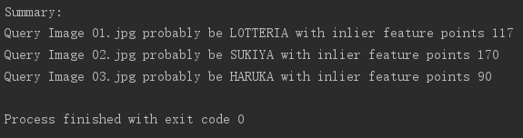
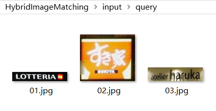
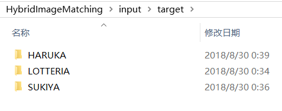

# Hybrid Image Matching

## Abstract
We propose the Hybrid Image Matching (HIM) method that combines the deep learning approach with the feature point matching to image classification.
Because there is no specialized training involved, the same process should also work for any other data without manual adjustment. 

## Introduction

The traditional methods apply feature vector techniques on image retrieval or classification. 
BoVW or deep learning-based image retrieval methods convert the query images and target images into fixed length feature vectors.
They then match query images with target images based on the similarity on their feature vector. 
Such method allows the quick retrieval of thousands of images in a dataset.

However, noise and imbalanced samples significantly affect the accuracy of image retrieval methods. 
For resolving this issue, we considered replacing feature vectors with feature point matching, which matches each query image with all target images based on corresponding feature points. 
Such feature point matching method can compensate for a noisy and unbalanced dataset because the correct query image and target image pair usually has more corresponding feature points than an incorrect one, regardless of image noise.

Computing time is the main consideration when applying feature point matching on a large-scale. 
Matching a query image with all the thousands of target images requires an unreasonable computing time. 
Therefore, we need to generate a candidate matching database, which is a smaller subset of all target signage patches, for each query image. 
The above-mentioned feature vector method is well suited for this task, 
because even under ideal circumstances the output from feature vector methods needs to undergo some form of further screening, 
as the correct pair does not always appear as the pair with the highest vector similarity score. 
These two methods, when used in tandem, serve well to complement each other’s disadvantages. 
Because the method combines the deep learning approach with the feature point matching for signage identification, 
we name this a Hybrid Image Matching (HIM) method.

## Environment and Dependences

- Ubuntu 16.04 +
- DeepMatching 1.2.2 [1] (already integrated)
- Python 3.6 +

Python Dependence:
- OpenCV 3.2 + (cv2)
- Tensorflow 1.2 +
- Keras 2.2.0 +

## Usage
1. Clone the source code
```text
git clone https://github.com/liaocyintl/HybridImageMatching.git
cd HybridImageMatching
``` 

2. Run the run.py as an example
```text
python run.py
```

3. If the process was done correctly, it should output a summary in the console.



## Input and Output Files

### Input: Query Images
Save the query images under the folder "input/query/" just like 

- input
    - query
        - 01.jpg
        - 02.jpg
        - 03.jpg
        - ...



### Input: Target Images
Save the target images under the folder "input/target/" with class name:

- input
    - target
        - class_name_1
            - 01.jpg
            - 02.jpg
            - 03.jpg
            - ...
        - class_name_2
            - 01.jpg
            - 02.jpg
            - 03.jpg
            - ...
        - ...
        

        
### Output
The matching result will be outputted in "output/result.json" as follows:
```json
{
  "01.jpg": [
    {"class_name": "LOTTERIA", "inlier": 117},
    {"class_name": "LOTTERIA", "inlier": 69},
    {"class_name": "SUKIYA", "inlier": 24}
  ],
  "02.jpg": [
    {"class_name": "SUKIYA", "inlier": 170},
    {"class_name": "SUKIYA","inlier": 133},
    {"class_name": "LOTTERIA","inlier": 15}
  ],
  "03.jpg": [
    {"class_name": "HARUKA","inlier": 90},
    {"class_name": "HARUKA","inlier": 70},
    {"class_name": "LOTTERIA","inlier": 11}
  ]
}
```
The structure of the result JSON file is
- Query Image Name
    - Predicted Class Name ("class_name")
    - Inlier Feature Point Number ("inlier")
    
The predicted class names in the list are sorted by the inlier feature point number.
Therefore the first one is probably the class of the query image. 

## Cite
If you like this work please cite our paper

```text
@article{liao2018,
  title={Image-Matching based Identification of Store Signage using Web-Crawled Information},
  author={Liao, Chenyi and Wang, Weimin and Sakurada, Ken and Kawaguchi, Nobuo},
  journal={IEEE ACCESS},
  volume={6},
  pages = {1-16},
  year={2018}
}
```

## References
[1]  J. Revaud, P. Weinzaepfel, Z. Harchaoui, and C. Schmid, “Deepmatching: Hierarchical deformable dense matching,” International Journal of Computer Vision (IJCV), pp. 1–24, 2016.